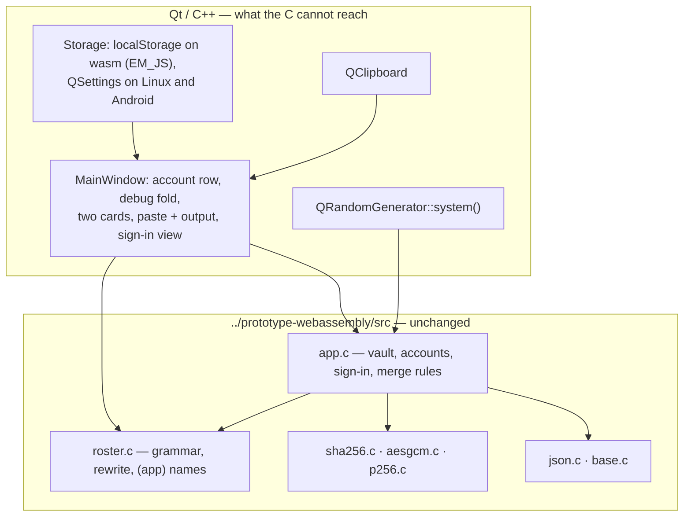

# prototype-minimal-qt

`prototype-minimal` again — same vault, same sign-in rules, same roster parse
and rewrite, same 🔍🐛 fold, same two game cards — as a Qt application built for
the PWA, Linux and Android. Asked for by Cedric on 2026-08-27.

This is the fourth telling of the same app: JavaScript (`prototype-minimal`),
C compiled to wasm (`prototype-webassembly`), Kotlin (`prototype-minimal-apk`),
now Qt. The interesting question is not whether Qt can draw it, but how little
new code the fourth telling needs.

## Decisions (with Cedric, before any code)

| | |
|---|---|
| **Logic: reuse the C core** | `../prototype-webassembly/src/*.c` compiles straight into the Qt app — 2,200 lines that already hold the vault rules, PBKDF2/AES-GCM/P-256, the plaintext format and the roster grammar, and that are already differential-tested against prototype-minimal's own JavaScript. "Behaves exactly like prototype-minimal" is then a property of the build, not of a fresh port. Verified before proposing it: the sources compile and run hosted against glibc. |
| **Native Qt look** | No stylesheet. Section for section and control for control the same app; it looks like Qt rather than like the dark CSS. |
| **`dist/` is committed** | Cedric asked for the outputs in `prototype-minimal-qt/dist`, binaries included — a fresh checkout can serve the PWA and install the APK without a toolchain. ~30 MB into the history, flagged and accepted. Intermediate build trees and Gradle's cache stay in `/shared/tmp`. |

## Shape

The C is called directly — no linear memory, no arena marshalling, just
`extern "C"` with `const char *` in and out. `wasm_reset()` still runs before
every operation, and every result is copied into a `QString` before the next
one, because the arena is reused.

One change to the sibling: `base.c` defines `memcpy`/`memset`/`memmove` for the
freestanding wasm build, and a hosted build already has them. They go behind
`#ifndef PROTO_HOSTED`, which this build defines and the sibling's `build.sh`
does not. `prototype-webassembly`'s own build and test suite must still pass
afterwards.

## Behaviour to match

Taken from `prototype-webassembly/app.js`, which is the same shell one language
up: sign-in tries every blob and reports one message for every failure, then
offers to create; create appends and never overwrites; the session survives a
restart but the key does not; **Unlock** re-derives for one blob; the vault box
merges what is pasted into it (same id replaces, identical salt+blob is a
no-op, anything else is added); delete-one and delete-all both confirm; the
cards render the first two date blocks and the toggle rewrites the roster.

Two things a browser gives prototype-minimal that Qt cannot — one of which
turned out to be wrong, see [QtKeychain](#qtkeychain-2026-09-09) below:

- **The credential store.** No `navigator.credentials`, so the silent
  re-derivation on load does not exist and the box always starts locked with
  the **Unlock** button — which is exactly what prototype-minimal does on
  Firefox and Safari.
- **Its own namespace.** The Qt PWA stores under `prototype-minimal-qt:…`, like
  `prototype-webassembly` does, so both can be open in one browser. The blob
  format is identical, so a vault still copy-pastes between them.

## Verification

- `prototype-webassembly`'s own test suite, re-run after the `base.c` change.
- A QTest suite driving the real widgets offscreen: create, sign out, sign in,
  wrong password, unlock, paste a roster, toggle, delete.
- The PWA served and clicked in headless Chromium.
- The APK assembled and signed; not run on a device.

## QtKeychain (2026-09-09)

Asked for by Cedric: use [QtKeychain][qtk] instead of having no credential
store. It has a backend for all three targets — GNOME Keyring/KWallet on Linux,
the Android keystore, and, on WebAssembly, the browser's own password manager
through `navigator.credentials` — so the deviation above disappears rather than
being narrowed to two targets.

[qtk]: https://github.com/frankosterfeld/qtkeychain

### Decisions (with Cedric, before any code)

| | |
|---|---|
| **Pin `main`, not a tag** | `keychain_wasm.cpp` landed after v0.14.0 and is in no release. Pinned to the exact commit `0deb2c0` (0.17.99, 2026-08-26), which is reproducible even though it is not a tag. The alternative — a release for native plus a hand-written `EM_JS` `navigator.credentials` path for the PWA — was rejected as two implementations of one thing. |
| **Submodule under `third_party/`** | Not `FetchContent`: this prototype's build had no network dependency and `dist/` is committed so a checkout works without a toolchain. 460 kB in the tree, and `build.sh` fetches it if it is missing. |
| **Store the password, not the key** | The key is 310 000 PBKDF2 iterations away and the blob is the only thing that can prove a password right, so the app re-derives — which is also exactly what the web page does with what the browser hands back. |
| **Keyed by username** | The same identity prototype-minimal gives its `PasswordCredential`, so an entry is recognisable in a password manager. Keying by the vault id would be enumerable — and would fix delete-all, see below — but would show a UUID where a person expects a name. |
| **PWA reads only on Unlock** | QtKeychain's wasm backend has to be a modal form, so a read on every page load would put a dialog where there is now a button that can be ignored. `Cred::silent()` is false there; Linux and Android read at startup on a restored session, which is where prototype-minimal calls `tryPrefill()`. |
| **Sign out keeps the entry** | As a browser does — it cannot delete a saved credential either. It is still durable: the startup read needs a session to name the user, and signing out removes the session. Deleting a user removes its password with its blob. |

### Known holes, accepted

- **Delete-all clears only the signed-in user's entry.** Every other username
  is encrypted inside a blob that is about to be erased, so there is nothing to
  name. Follows directly from keying by username.
- **The PWA cannot delete at all.** `DeletePasswordJob` reports
  `NotImplemented`; a page cannot reach into the browser's password manager.
- **The Android keystore path is unverified on hardware.** It compiles into the
  APK and nothing here is Android-specific, but that is all that is shown.

### Verification

- 6 new QTest functions over a fake keyring, plus 2 existing ones adjusted to
  say explicitly that they run on a device with nothing saved. 14 in total,
  all passing against Qt 6.7.3 offscreen.
- All three targets built. The Android backend confirmed present in the
  packaged `.so` by its symbols; the wasm bridge form confirmed in the shipped
  glue.
- The PWA driven in headless Chromium through the whole round trip: the *Save*
  form on create, no dialog on reload, the *Sign In* form on Unlock, the
  plaintext refilled from it, and no second modal after.
