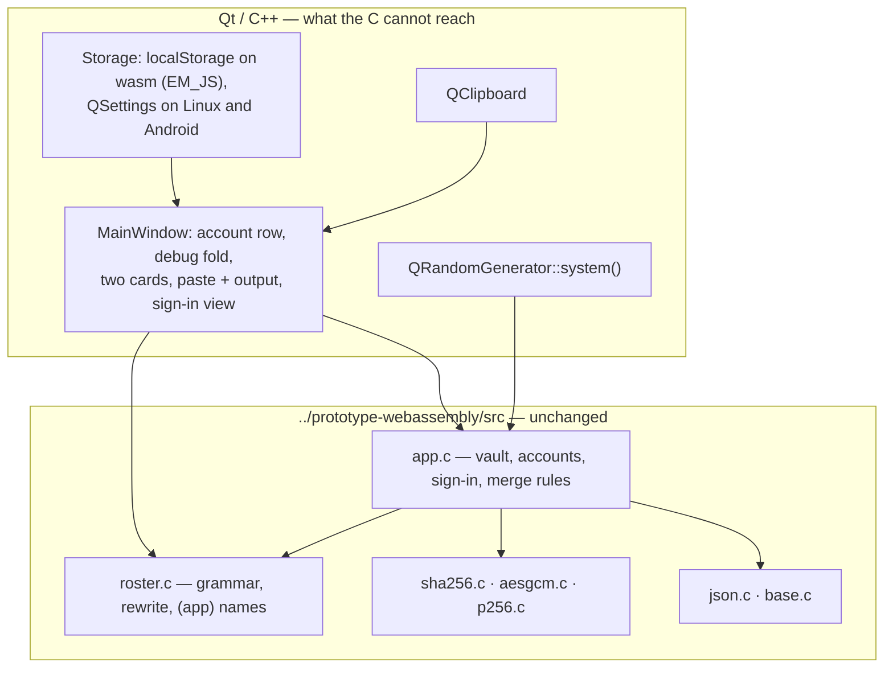

# prototype-minimal-qt

`prototype-minimal` again — same vault, same sign-in rules, same roster parse
and rewrite, same 🔍🐛 fold, same two game cards — as a Qt application built for
the PWA, Linux and Android. Asked for by Cedric on 2026-08-27.

This is the fourth telling of the same app: JavaScript (`prototype-minimal`),
C compiled to wasm (`prototype-webassembly`), Kotlin (`prototype-minimal-apk`),
now Qt. The interesting question is not whether Qt can draw it, but how little
new code the fourth telling needs.

## Decisions (with Cedric, before any code)

| | |
|---|---|
| **Logic: reuse the C core** | `../prototype-webassembly/src/*.c` compiles straight into the Qt app — 2,200 lines that already hold the vault rules, PBKDF2/AES-GCM/P-256, the plaintext format and the roster grammar, and that are already differential-tested against prototype-minimal's own JavaScript. "Behaves exactly like prototype-minimal" is then a property of the build, not of a fresh port. Verified before proposing it: the sources compile and run hosted against glibc. |
| **Native Qt look** | No stylesheet. Section for section and control for control the same app; it looks like Qt rather than like the dark CSS. |
| **`dist/` is committed** | Cedric asked for the outputs in `prototype-minimal-qt/dist`, binaries included — a fresh checkout can serve the PWA and install the APK without a toolchain. ~30 MB into the history, flagged and accepted. Intermediate build trees and Gradle's cache stay in `/shared/tmp`. |

## Shape

The C is called directly — no linear memory, no arena marshalling, just
`extern "C"` with `const char *` in and out. `wasm_reset()` still runs before
every operation, and every result is copied into a `QString` before the next
one, because the arena is reused.

One change to the sibling: `base.c` defines `memcpy`/`memset`/`memmove` for the
freestanding wasm build, and a hosted build already has them. They go behind
`#ifndef PROTO_HOSTED`, which this build defines and the sibling's `build.sh`
does not. `prototype-webassembly`'s own build and test suite must still pass
afterwards.

## Behaviour to match

Taken from `prototype-webassembly/app.js`, which is the same shell one language
up: sign-in tries every blob and reports one message for every failure, then
offers to create; create appends and never overwrites; the session survives a
restart but the key does not; **Unlock** re-derives for one blob; the vault box
merges what is pasted into it (same id replaces, identical salt+blob is a
no-op, anything else is added); delete-one and delete-all both confirm; the
cards render the first two date blocks and the toggle rewrites the roster.

Two things a browser gives prototype-minimal that Qt cannot:

- **The credential store.** No `navigator.credentials`, so the silent
  re-derivation on load does not exist and the box always starts locked with
  the **Unlock** button — which is exactly what prototype-minimal does on
  Firefox and Safari.
- **Its own namespace.** The Qt PWA stores under `prototype-minimal-qt:…`, like
  `prototype-webassembly` does, so both can be open in one browser. The blob
  format is identical, so a vault still copy-pastes between them.

## Verification

- `prototype-webassembly`'s own test suite, re-run after the `base.c` change.
- A QTest suite driving the real widgets offscreen: create, sign out, sign in,
  wrong password, unlock, paste a roster, toggle, delete.
- The PWA served and clicked in headless Chromium.
- The APK assembled and signed; not run on a device.
