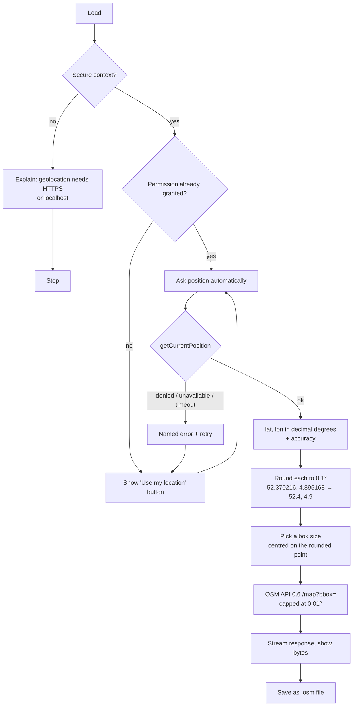

# prototype-OSM

A PWA that asks for your location, rounds it to 0.1°, and offers to download
the OSM map data for that spot.

Lives in `ai-trash/prototypes/prototype-OSM/`, following the same shape as the
other prototypes: `index.html` + `app.js` + `sw.js` + `manifest.json` +
`icon.svg` + `README.md`, no build step and no external dependency.

## Flow

## The two numbers

`roundTenth(deg)` rounds half **away from zero**, so the grid is symmetric
across the equator and the prime meridian — plain `Math.round` biases negative
values one way and positive ones the other. Kept as integer tenths internally
to avoid `52.400000000000006` on screen and in the bbox.

The rounded pair is the location identifier. The 0.1° cell it names spans
`±0.05°` around it: about 11.1 km north-south, and 6.9 km east-west at 52°N.

## What can actually be downloaded

Measured against the live APIs on 2026-08-22, not assumed:

| Request | Result |
|---|---|
| OSM API, 0.1° cell (rural) | **400** — "too many nodes (limit is 50000)" |
| OSM API, 0.05° (city) | **400** — same |
| OSM API, 0.02° (city) | **400** — same |
| OSM API, 0.01° (Amsterdam) | 200 — 13.4 MB in 2.0 s |
| OSM API, 0.005° (Amsterdam) | 200 — 4.3 MB in 0.7 s |
| OSM API, 0.01° (rural) | 200 — 1.2 MB in 0.4 s |
| OSM API, 0.03° (rural) | 200 — 8.0 MB in 1.7 s |
| Overpass, 0.1° cell (rural) | 200 — **219 MB in 42 s** |

So the OSM API's `/map` endpoint cannot serve a 0.1° cell **anywhere** — the
50k-node cap bites well before that, even over farmland. The node budget is
spent between 0.01° and 0.02° in a city, and between 0.03° and 0.1° in the
countryside.

Both endpoints are reachable from a browser: Overpass sends
`Access-Control-Allow-Origin: *`, the OSM API reflects the requesting origin.

### Consequence for the UI — capped at 0.01°

Overpass was on the table for the full cell until the 219 MB measurement came
back; **Cedric's call was to drop it and cap the download at 0.01°**, so there
is one source and no way to ask for a heavy transfer:

- `0.005°` / `0.01°` (default) → OSM API `/map`, the canonical raw `.osm` XML,
  the same call JOSM makes. Roughly 1.1 km × 0.7 km at the top size.
- No Overpass, no whole-cell option.

A 400 from the OSM API is reported as what it is — too much data for that
size — with a nudge to 0.005°, rather than as a generic failure.

## Decisions

- **Default and maximum 0.01°**, the largest box that came back under the node
  cap in a dense city.
- **The cap lives in one function** (`currentSize()`), because clamping it only
  inside `download()` let the panel advertise a box bigger than the one
  actually fetched.
- **No map rendering.** No tile fetching either: the tile servers are a
  separate service with their own usage policy, and the ask is map *data*.
- **Cancellable** downloads via `AbortController`, with bytes-received shown
  while streaming — a 219 MB transfer with no feedback is unusable.
- **Network-first service worker**, the same one `prototype-minimal` now uses.
  It only ever touches same-origin shell files; API calls are cross-origin and
  pass straight through.

## Open risks

- The response is buffered as a Blob before the browser can save it. At 0.01°
  that is a couple of megabytes, which is the point of the cap. Streaming
  straight to disk needs the File System Access API, which Gecko lacks.
- The box is centred on the **rounded** pair, so it frequently does not contain
  the actual position — up to 5.6 km away. Made visible in the panel rather
  than silently accepted.

## Acceptance

1. Loading over plain HTTP off-localhost explains why it cannot work.
2. Denying the permission produces a named error and a retry, not a dead page.
3. A granted position shows decimal degrees, accuracy, and the pair rounded
   to 0.1°.
4. Downloading at the default size saves a `.osm` file that parses as XML and
   contains `<node>` elements inside the requested bbox.
5. An over-large request reports the node-limit reason and suggests a smaller
   size.
6. The app shell still loads with the network offline.

## Outcome

All six met, verified in headless Chromium against the live API with a faked
position (Amsterdam, 52.370216 / 4.895168):

- Rounds to **52.4 °N, 4.9 °E**; the cell prints as 52.35°–52.45°, 4.85°–4.95°.
- Downloads **2.46 MB**, 9 117 nodes, 1 002 ways, and the file's `<bounds>`
  matches the requested bbox exactly.
- Refused permission, an insecure origin, cancelling mid-flight, and a size
  forced past the cap all behave.
- The node-limit path was checked against a real 400 from the live API (a 0.1°
  bbox), and reports the API's own sentence plus "Try 0.005°".
- With the network emulated offline the shell still loads from the service
  worker, and a download attempt fails cleanly with "Could not reach the API".

Two bugs the tests caught, both now fixed:

1. The cell edges (52.35, 52.45) were printed through the one-decimal
   formatter and collapsed to "52.4 to 52.4".
2. `hidden` on a `<button>` did nothing, because the author rule
   `button { display: inline-block }` outranks the UA stylesheet's
   `[hidden] { display: none }`. The Cancel button stayed on screen after a
   download finished — **and `prototype-minimal` had shipped the same bug**,
   leaving its Unlock button visible while signed out. Fixed in both.
