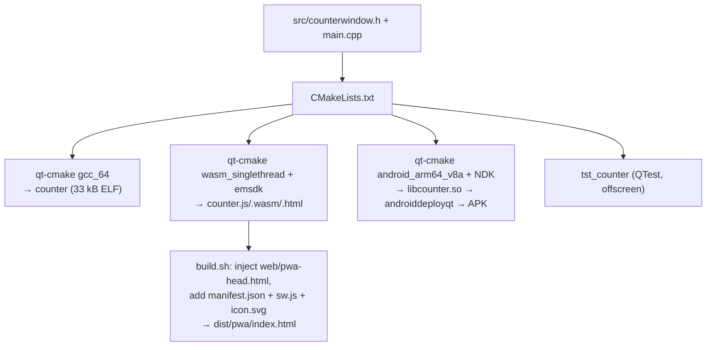

# prototype-qt

One button and one textbox counting its presses, written once in Qt 6 and
built into a PWA, a native Linux executable and an Android APK by a single
script. Asked for by Cedric on 2026-08-26.

The app is trivial on purpose. What is being prototyped is the **toolchain**:
how much of "one source tree, three platforms" Qt actually delivers, what each
target costs in bytes, and what has to be true of the build environment.

## Decisions

| | |
|---|---|
| Qt Widgets, not QML | Widgets needs only `qtbase`, which is what aqt puts in the wasm and Android packages. QML would add a runtime, a second language and `qtdeclarative` to all three targets for a button and a text field. |
| One `build.sh`, four sub-targets | `linux`, `test`, `pwa`, `android`; no argument builds all four. Cedric asked for one script. |
| Build in `claude-code-agent-qt` | The image already exists (`Dockerfile.qt`, 16 GB, Qt 6.7.3 for linux/wasm/android). The agent session runs on the plain image, so `--docker` re-runs the script inside the Qt one over the mounted Docker socket. |
| Artifacts to `/shared/tmp` | Nothing generated in the source tree; 14 MB of wasm and a 15 MB APK are build output, not web assets, so unlike `prototype-webassembly`'s 47 kB `app.wasm` they are not committed. |
| Patch Qt's wasm shell, don't replace it | The PWA head block is injected into the generated `counter.html` before `</head>` and written out as `index.html`. Qt has changed its loader twice in the 6.x series; hand-written glue would need re-deriving each time. |
| Android built Debug | androiddeployqt signs the debug APK with the standard debug key, so it installs. A release APK needs a keystore, which is not in the repo. |

## Layout

## What the build had to be taught

Found by building it, in this order:

1. **aqt ships the wasm `bin/qt-cmake` without the executable bit.** Every
   `qt-cmake` is run through `sh`.
2. **The image's `$QT_HOST_LINUX` points at `linux_gcc_64`, which does not
   exist** (the Qt is at `gcc_64`). The script searches for the host Qt instead
   of trusting the variable.
3. **XML comments cannot contain `--`.** The Android manifest's placeholders
   are `-- %%INSERT_VERSION_CODE%% --`, so a comment mentioning them makes
   androiddeployqt fail with `Expected '>', but got ' '`.
4. **Emscripten must be the exact version Qt was built against.** 3.1.56
   against Qt 6.7.3 (which wants 3.1.50) compiles, links, loads, creates its
   canvas — and never paints, leaving a blank grey page and
   `QPainter::begin: Paint device returned engine == 0` in the console.
   `build.sh` now reads the wanted version out of Qt's own cmake files, picks a
   matching emsdk (`$EMSDK_DIR`, `/shared/tmp/emsdk-<version>`, `/opt/emsdk`)
   and refuses to build against a mismatch. The real fix is
   `ARG EMSDK_VERSION=3.1.50` in `Dockerfile.qt`.

## Verification

- `ctest` in the host build: the widget under `QT_QPA_PLATFORM=offscreen`,
  three test functions, synthetic clicks.
- The PWA served and driven in headless Chromium over CDP: paints, and three
  clicks on *Press me* leave `3` in the textbox.
- The APK checked with `aapt2 dump badging` and `apksigner verify`
  (`org.pgo.qtcounter`, minSdk 28, v2 signature). Not run on a device.

## Not done

- Windows. `Dockerfile.qt` carries MXE for a static `.exe`; `build.sh` has no
  `windows` target.
- A release-signed APK, a portable (static or `linuxdeploy`-bundled) Linux
  binary, and any attempt to make 14 MB of Qt-on-the-web smaller.
