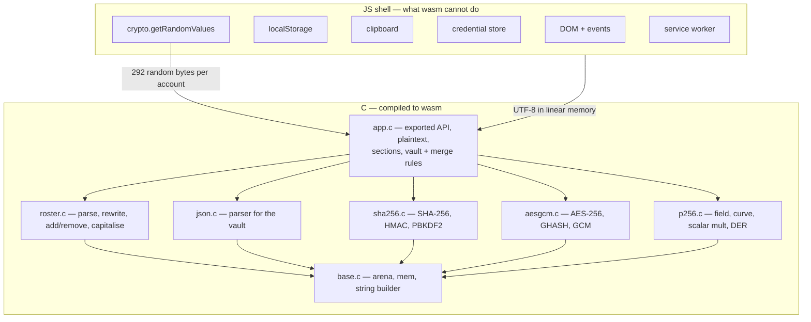

# prototype-webassembly

`prototype-minimal`, feature for feature, with every piece of logic and every
cryptographic primitive written in C and compiled to WebAssembly. The only
things left to JavaScript are the ones WebAssembly cannot reach: the DOM,
`localStorage`, the clipboard, the credential store, the service worker — and
entropy, which has to come from `crypto.getRandomValues` because a wasm module
has no source of randomness of its own.

Decided with Cedric: **everything in C, including P-256.** `crypto.subtle` is
not used at all.

## Toolchain

Checked before designing anything:

| | |
|---|---|
| `clang` | 20.1.8, targets `wasm32` |
| `wasm-ld` | present at `/usr/lib/llvm-20/bin/wasm-ld` |
| Emscripten | **not installed, and not needed** |

Freestanding build, no libc:

```sh
clang --target=wasm32 -nostdlib -O2 \
      -Wl,--no-entry -Wl,--export-dynamic -o app.wasm src/*.c
```

Verified end to end before committing to the approach: exports callable from
JS, imports calling back into JS, and linear memory readable from both sides.
No libc means no `malloc`, no `string.h`, no `printf` — the module carries a
bump allocator and its own `memcpy`/`memcmp`.

## Layers



## How each layer gets proved

Node 22 has `globalThis.crypto.subtle` and `node:crypto`, so the C can be
tested against an independent implementation without a browser:

| Layer | Test |
|---|---|
| SHA-256 | NIST vectors, then random inputs against `node:crypto` |
| HMAC-SHA256 | RFC 4231 vectors |
| PBKDF2 | against `crypto.pbkdf2Sync`, same salt/iterations |
| AES-256-GCM | against `createCipheriv`, both directions, plus tag rejection |
| P-256 scalar mult | take `d` out of a key Node generated, multiply by G in C, compare Q |
| P-256 DER | import the C module's SPKI/PKCS8 into WebCrypto, sign and verify |
| whole account | a blob written by C must decrypt in WebCrypto — and a blob written by `prototype-minimal` must open in the C module |

That last row is the real acceptance test: the two prototypes share a storage
format, so their vaults have to be interchangeable.

## P-256 notes

- 8 × 32-bit limbs, 64-bit intermediates.
- **Montgomery multiplication**, not the Solinas fast reduction — uniform, far
  easier to get right, and the same code serves any modulus.
- `R² mod p` is *computed at startup* by 512 doublings rather than hardcoded,
  so there is one less constant to get wrong. The curve constants (p, n, b, G)
  are hardcoded, and a wrong one is caught immediately by the scalar-mult
  comparison against Node.
- Jacobian coordinates, `a = -3` doubling, `add-2007-bl` addition.
- Scalar multiplication is double-and-always-add with a conditional move, so
  the bit pattern does not drive the branch. **This is not a hardened
  implementation** — no blinding, no claim about caches or compiler-introduced
  branches — and the README says so.
- Keygen uses rejection sampling over several candidate scalars supplied by the
  host, rather than reducing one candidate mod n.

## Open questions settled

- **The `.wasm` is committed.** It is a shipped web asset, not a build
  artifact: without it a fresh checkout cannot be served to a phone, and the
  other prototypes are all zero-build. `build.sh` regenerates it.
- **Separate storage namespace** (`prototype-webassembly:*`), so the two
  prototypes do not fight over the same vault while both are being tested —
  even though the blob format is identical and a vault can be pasted across.

## Outcome

Built and green. `./tests/run-tests.sh` runs five suites; all pass.

- **SHA-256 / HMAC / PBKDF2** — NIST and RFC vectors, then `node:crypto` on
  random inputs. The real 310 000-iteration derivation takes **~560 ms**.
- **AES-256-GCM** — FIPS-197 C.3, then `createCipheriv` in both directions
  across eight aad/plaintext length combinations, and a flipped tag bit is
  refused.
- **P-256** — `1·G` is the base point, `d·G` matches six independently
  generated Node keys, `0`, `n` and `n+1` are refused, and the SPKI/PKCS8 the
  module emits imports into WebCrypto, where a signature round-trips and the
  key reads back with the same d/x/y. **~0.5 ms per keypair.**
- **Account and vault** — creation, sign-in, wrong password, unlock by id,
  merge rules, and **both directions of interop with prototype-minimal's
  format**: WebCrypto opens a C-written blob, and the C opens a blob written
  the prototype-minimal way.
- **Roster** — a differential test against prototype-minimal's own JavaScript,
  lifted out of its `app.js`. 99 comparisons, byte for byte.

The differential test paid for itself immediately, catching the two real bugs
in the port:

1. An extra newline after any block whose player lines ran to the end of the
   text — the splice replaces a *range* of lines with a different number of
   lines, and emitting a separator per source line got that wrong.
2. CRLF input. The JS `split(/\r?\n/)` quietly normalises to LF; the C was
   preserving the carriage return, which is more faithful to the input and less
   faithful to the thing being matched.

Browser-tested end to end as well: create, roster paste, join and leave both
cards, reload to locked, wrong then right unlock, a second account, the vault
box, and delete.

## Acceptance

Everything `prototype-minimal` does, done here: create and sign in, wrong
password refused without saying which half was wrong, vault copy/paste/merge,
delete one and delete all, session survives reload, silent re-unlock from a
saved credential, the Unlock button, the 🔍🐛 debug fold, the roster parse and
rewrite with `(app)` names, the two game cards, and the clipboard buttons —
plus a `[group1]` ECDSA P-256 keypair generated in C for every new account.
